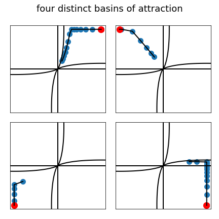

# Brain-state-in-a-box model (1977)

## Brain-state-in-a-box model for unsupervised categorization

### Table of Contents

- [Images](#images)
- [Description](#description)
- [Keywords](#keywords)
- [How to Use](#how-to-use)
- [References](#references)
- [Author Info](#author-info)

## Images

## Description

"Brain-state-in-a-box model for unsupervised categorization."

#### Technologies

- Python programming language

## Keywords

 - Unsupervised model
 - Categorization
 - Basins of attraction
 - Piecewise-linear activation function
 - Connection weight matrix
 - Eigenvectors
 - Eigenvalues

## How to Use

#### Getting started

`git clone https://github.com/berberianareg/Brain-state-in-a-box.git`

#### Dependencies

see requirements.txt

#### Installation

`pip install numpy`

`pip install matplotlib`

#### Executing the program from command line

`python BSB.py`

## References

#### Links

- Relevant paper - (https://psycnet.apa.org/record/1978-22353-001)

## Author Info

- Twitter - [@berberianareg](https://twitter.com/BerberianNareg)
- LinkedIn - [Nareg Berberian](https://www.linkedin.com/in/nareg-berberian-phd-ab6759b9/)

[Back to the Top](#brain-state-in-a-box-model-1977)

